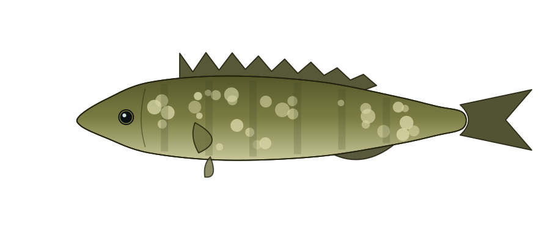

# 🎣 Hooked

A personal fishing instrument — your own lightweight Fishbrain. For each of your local spots it
shows today's **tide**, the **best-time bite windows**, and **what's biting** with ranked tackle,
in a dark marine-instrument UI. Zero build, zero backend, zero runtime API keys. Runs free on
GitHub Pages.



## Quick start

```bash
make install      # python + node deps (cairosvg, pillow, suncalc)
make serve        # serves at http://localhost:8000  — open that, not the file directly
```

> The app fetches `data/*.json`, so it must be served over http. Opening `index.html` from a
> `file://` path will show a "could not load data" message — use `make serve` or deploy.

## First-time setup

The vector fish plates already ship, so the app works immediately. The one optional upgrade is
**photoreal fish images** (you haven't run this yet):

```bash
# cheapest cloud (~$0.28 one-time for all 14 fish; only draws missing ones)
GEMINI_API_KEY=xxxx make photos
# add --transparent for cut-out backgrounds:
GEMINI_API_KEY=xxxx python3 scripts/fishgen_photo.py --transparent
```

Photos drop into `images/fish/` and the app prefers them over the vector plates automatically.
Prefer free + unlimited? Point `scripts/fishgen_photo.py` at a local Stable Diffusion / ComfyUI
endpoint (provider stub included) for $0.

## Deploy (free)

Push to GitHub and enable **Settings → Pages → deploy from branch (root)**. That's it — the live
URL is your personal app. (Cloudflare Pages / Netlify work the same way.)

## Commands

| Command          | What it does                                                        |
|------------------|---------------------------------------------------------------------|
| `make serve`     | Local dev server at :8000                                           |
| `make plates`    | Draw vector field-guide plates → `images/fish/vector/` (free)       |
| `make photos`    | Generate photoreal plates → `images/fish/` (needs key or local SD)  |
| `make enrich`    | Fill missing species in `species.json` via Gemini free tier         |

## Add a spot or a fish

- **New spot** → add an object to `data/locations.json` (name, lat/lon, NOAA `station`, `tags`,
  and a `fish` list of `{slug, tide, light, note}`). Verify the station ID at
  [NOAA's map](https://tidesandcurrents.noaa.gov/map).
- **New fish** → add a `<slug>` entry to `data/species.json` (or run `make enrich`), then
  `make plates` (and optionally `make photos`) — only the new fish gets drawn.

## Structure

```
index.html              app shell
src/
  styles.css            all styling (dark marine-instrument theme)
  app.js                UI + inline bite-score engine (loads data/*.json)
  fishing-core.js       real engine: live NOAA + Open-Meteo (wire-in for live data — see CLAUDE.md)
data/
  locations.json        your spots (source of truth)
  species.json          fish + ranked tackle, keyed by slug
scripts/
  fishgen.py            vector plates  → images/fish/vector/
  fishgen_photo.py      photoreal plates → images/fish/
  enrich.mjs            optional: fill species via Gemini free tier
images/fish/
  vector/               committed vector plates (fallback, always present)
  <slug>.png            your generated photos (override vectors)
```

## How the score works

`bite = 0.45·tide + 0.33·solunar + 0.22·light`, then scaled by weather. Tide is the rate-of-change
of the tide curve (peaks mid-tide, ~0 at slack — moving water feeds fish). Drag the NOW marker on
the tide instrument to preview any time of day. Weights are at the top of `src/app.js` /
`src/fishing-core.js` — tune them to your spots.

## Notes

- Free at runtime: NOAA CO-OPS (tides) and Open-Meteo (weather) need no keys; SunCalc runs in the
  browser. Keys only live in the local generation/enrich scripts.
- Tide data is **sample data** until live wiring is enabled (see CLAUDE.md → Roadmap).
- Verify station IDs and current regulations before fishing. Irvine Lake bass are catch-and-release.
